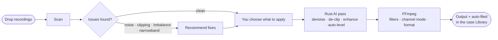

<div align="center">


# DepoAudio

**Desktop audio converter & enhancer for court reporters — and anyone with tricky audio.**

Convert proprietary court‑recording formats, clean up noisy audio with on‑device AI, and keep every case organized — 100% locally, no cloud.

[](../../actions/workflows/ci.yml)
&nbsp;
&nbsp;
&nbsp;
&nbsp;

[**⬇ Download**](../../releases/latest) · [Website](https://depoaudio.com) · [Install guide](https://depoaudio.com/install/) · [Changelog](CHANGELOG.md) · [Report a bug](../../issues)

</div>

---

## What it does

DepoAudio handles the audio side of a deposition or hearing, end to end:

- 🎧 **Convert** proprietary court formats (Stenograph SGMCA, FTR `.trm`, CourtSmart BWF) and standard audio to WAV, MP3, FLAC, Opus, or M4A — mix to stereo, keep the channel layout, or split one file per speaker.
- ✨ **Clean up** with on‑device AI: remove background noise, balance quiet vs. loud speakers, reconstruct clipped peaks, and extend narrow‑band phone audio — all recommended automatically by a one‑click **Scan**.
- 📝 **Transcribe & review** in a built‑in player with a synced transcript editor (SRT/VTT/TXT), 0.5×–2× speed, A‑B loop, and bookmarks.
- 🗂️ **Organize** every conversion into an auto‑filed case library, and pull recordings straight from installed court software.

> **100% local.** All processing runs on your machine — no uploads, no accounts, no subscription.

---

## Download

| Platform | Download |
|----------|----------|
| **macOS** 12+ | Universal `.dmg` — one download runs on Apple Silicon **and** Intel |
| **Windows** 10/11 | `.msi` installer |

### ➡️ [Get the latest release](../../releases/latest)

> Builds aren't code‑signed yet, so macOS (Gatekeeper) and Windows (SmartScreen) show a one‑time warning on first launch. The [install guide](https://depoaudio.com/install/) walks through it.

---

## How it works



Scanning is a bounded, cancellable analysis pass; conversion is a two‑step pipeline — a Rust AI stage feeds a clean signal into FFmpeg for the final format and channel layout. Everything is local and reproducible.

---

## Features

<table>
<tr><td width="50%" valign="top">

### 🎧 Conversion
- **Court + standard formats** in, five formats out (WAV · MP3 · FLAC · Opus · M4A)
- **Three output modes** — mix to stereo, keep original, or split by channel
- **Per‑channel** labels and volume
- **Batch** the whole session at once

### 🗂️ Library & detection
- **Case library** — auto‑filed by case, with search, archive, inline play, and re‑export
- **Court‑software detection** — Case CATalyst, FTR Gold, Eclipse, DigitalCAT, CourtSmart
- **Import jobs** straight from detected directories

</td><td width="50%" valign="top">

### ✨ Smart cleanup (on‑device AI)
- **Scan** detects noise, level imbalance, clipping, and narrow bandwidth
- **Denoise** (RNNoise fast / DeepFilterNet3 best)
- **Auto‑level** — turn‑aware, measures loudness during speech
- **De‑clip** distorted peaks · **Clarity** (FlashSR bandwidth extension)
- **Turn / speaker‑count / quality (DNSMOS)** detection
- **Hardware‑aware** — uses NPU/GPU when present
- **Live progress** with a Cancel button; stuck files never freeze the app

### ▶️ Player & transcript editor
- Color‑coded tracks, **0.5×–2× speed**, **A‑B loop**, editable **bookmarks**
- **Synced transcript** — import/edit/export SRT · VTT · TXT with follow‑along highlighting and playhead stamping
- Full keyboard transport

</td></tr>
</table>

### 🔗 Merge & general
- **Merge** a backup mic and a phone dial‑in of one session — auto‑synced, then **Best Quality** or **Mix All**
- **Dark & light** themes (system‑aware) · **auto‑updates** from GitHub Releases (signed, in‑place)

---

## Supported formats

| Format | Vendor | Status |
|--------|--------|--------|
| **SGMCA** | Stenograph · Case CATalyst | ✅ Supported |
| **FTR / TRM** | For The Record | 🧪 Experimental |
| **BWF** | CourtSmart · Various | ✅ Supported |
| **DigitalCAT (.dm)** | Stenovations | 🧪 Experimental |
| **WAV, MP3, FLAC, M4A, OGG, Opus, WMA, AIF** | Standard | ✅ Supported |
| **Video (MP4, MOV, MKV, AVI, WebM)** | — audio track extracted | ✅ Supported |
| **AES (Eclipse AudioSync)** | Eclipse CAT | 🔒 Encrypted — export to WAV first |

---

## AI models

Light models ship bundled. Larger and optional models download on demand from the
[`models-v1`](../../releases/tag/models-v1) release into the app data directory
(SHA‑256 verified) the first time their feature is used — keeping the installer small.

| Model | Size | Purpose | Delivery |
|-------|------|---------|----------|
| Silero VAD | 2.1 MB | Voice activity detection | Bundled |
| Smart Turn v3 (int8) | 8.2 MB | Speaker turn detection | Bundled |
| FlashSR | 487 KB | Bandwidth extension (16→48 kHz) | Bundled |
| DeepFilterNet3 (3 files) | 8.2 MB | Premium speech denoising | Bundled |
| Speaker segmentation (int8) | 1.5 MB | Speaker count detection | Bundled |
| Speaker embedding | 38 MB | Speaker identification | Download on demand |
| DNSMOS | 1.1 MB | Audio quality scoring | Download on demand |

---

## Development

### Prerequisites
- [Rust](https://rustup.rs/) (stable) · [Node.js](https://nodejs.org/) 22+ · [Tauri CLI](https://v2.tauri.app/start/prerequisites/) (`cargo install tauri-cli`)

### FFmpeg sidecars
Place FFmpeg/FFprobe binaries in `src-tauri/binaries/` with target‑triple names (not committed):

| Platform | Files |
|----------|-------|
| macOS ARM | `ffmpeg-aarch64-apple-darwin`, `ffprobe-aarch64-apple-darwin` |
| macOS Intel | `ffmpeg-x86_64-apple-darwin`, `ffprobe-x86_64-apple-darwin` |
| Windows x64 | `ffmpeg-x86_64-pc-windows-msvc.exe`, `ffprobe-x86_64-pc-windows-msvc.exe` |

Download from [ffmpeg.org](https://ffmpeg.org/download.html) or [evermeet.cx/ffmpeg](https://evermeet.cx/ffmpeg/) (macOS).

### Run & build
```bash
npm install
npm run tauri dev     # develop
npm run tauri build   # package installers
```

### Project layout
```
src/                     # React 19 frontend
  components/
    Convert/  Player/  Merge/  Library/  common/
  hooks/                 # theme, prefs, conversion
  App.jsx                # app shell — sidebar nav (Convert · Player · Merge · Library)
src-tauri/               # Rust backend (Tauri 2)
  src/
    analysis.rs          # bounded, cancellable Scan + Smart-Turn inference
    conversion.rs        # two-step pipeline (Rust AI → FFmpeg)
    ffmpeg.rs            # sidecar + filter chain      denoise.rs / dereverb.rs
    enhance.rs           # FlashSR bandwidth extension  vad.rs / mel.rs
    scoring.rs speakers.rs   # DNSMOS + speaker count   merge.rs
    models.rs            # ONNX loader + hardware detect
    catdetect.rs         # court-software detection     safety.rs / helpers.rs
    commands.rs types.rs persistence.rs
  resources/models/      # bundled light ONNX models
  binaries/              # FFmpeg/FFprobe sidecars (not committed)
.github/workflows/       # CI + release builds
```

**Stack:** Tauri 2 · Rust · React 19 · Vite · FFmpeg · ONNX Runtime · nnnoiseless

See [`PARITY.md`](PARITY.md) for the full capability/contract inventory that the characterization tests pin.

---

## Releasing

Push a version tag matching `version` in `src-tauri/tauri.conf.json`:

```bash
git tag vX.Y.Z
git push origin vX.Y.Z
```

GitHub Actions builds a **universal macOS** `.dmg` and a **Windows** `.msi`, then creates a **draft** release with all assets. The workflow verifies the tag matches the configured version and clears any stale *draft* with the same tag before building (published releases are never touched).

> **Let the workflow finish before publishing the draft.** The platform builds run one after another, so the draft looks complete while later platforms are still building. Publishing early strands the remaining platform's artifacts in a new draft — the run's `finalize` job now heals that automatically (it promotes stray draft assets into the published release), but waiting for the green check avoids the churn.

<details>
<summary><strong>Enabling signed auto‑updates</strong> (one‑time)</summary>

The in‑app updater is wired up but **dormant until a signing key is configured** — releases build fine without it; updates simply aren't offered.

1. **Generate a keypair** (keep the private key safe — losing it means you can't ship updates):
   ```bash
   npx tauri signer generate -w ~/.tauri/depoaudio.key
   ```
2. **Publish the public key**: copy `~/.tauri/depoaudio.key.pub` into `src-tauri/tauri.conf.json` → `plugins.updater.pubkey`.
3. **Add repo secrets**: `TAURI_SIGNING_PRIVATE_KEY` (contents of `~/.tauri/depoaudio.key`) and `TAURI_SIGNING_PRIVATE_KEY_PASSWORD` if set.

The release workflow then builds/signs the updater artifacts and publishes `latest.json`; installed apps check it on launch and offer in‑place updates. **Publish** the draft release for clients to see it.
</details>

---

## License

[MIT](LICENSE) © Andrew Mayes
