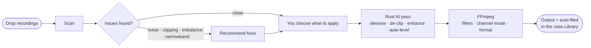

# DepoAudio

**Desktop audio converter & enhancer for court reporters — and anyone with tricky audio.**

Convert proprietary court-recording formats, clean up noisy audio with on-device AI, and keep every case organized — 100% locally, no cloud.

[](../../actions/workflows/ci.yml)    

[**⬇ Download**](../../releases/latest) · [Website](https://depoaudio.com) · [Install guide](https://depoaudio.com/install/) · [Changelog](CHANGELOG.md) · [Report a bug](../../issues)

---

## What it does

DepoAudio handles the audio side of a deposition or hearing, end to end:

- 🎧 **Convert** proprietary court formats (Stenograph SGMCA, FTR `.trm`, CourtSmart BWF) and standard audio to WAV, MP3, FLAC, Opus, or M4A — mix to stereo, keep the channel layout, or split one file per source channel and name it by role.
- ✨ **Clean up** with on-device AI: remove background noise, balance quiet vs. loud speakers, reconstruct clipped peaks, and extend narrow-band phone audio — all recommended automatically by a one-click **Scan**.
- ▶️ **Play & review** in a built-in player — color-coded speaker tracks, 0.5×–2× speed, A-B loop, bookmarks, and a synced transcript editor.
- 🗂️ **Organize** every conversion into an auto-filed case library, and pull recordings straight from installed court software.

> **100% local.** All processing runs on your machine — no uploads, no accounts, no subscription.

---

## Download

| Platform          | Download                                                            |
| ----------------- | ------------------------------------------------------------------- |
| **macOS** 13.3+   | Universal `.dmg` — one download runs on Apple Silicon **and** Intel |
| **Windows** 10/11 | `.msi` installer                                                    |

**➡️ [Get the latest release](../../releases/latest)**

> Current release automation fails closed unless both the application and updater artifacts can be signed. Historical downloads may predate that policy; verify the release notes before installing one.

---

## How it works


```mermaid
flowchart LR
    A([Drop recordings]) --> B[Scan]
    B --> C{Issues found?}
    C -->|noise · clipping · imbalance · narrowband| D[Recommend fixes]
    C -->|clean| E
    D --> E[You choose what to apply]
    E --> F[Rust AI pass<br/>denoise · de-clip · enhance · auto-level]
    F --> G[FFmpeg<br/>filters · channel mode · format]
    G --> H([Output + auto-filed<br/>in the case Library])
```

Scanning is a bounded, cancellable analysis pass; conversion is a two-step pipeline — a Rust AI stage feeds a clean signal into FFmpeg for the final format and channel layout. Everything is local and reproducible.

---

## Features

### 🎧 Conversion

- **Court + standard formats** in, five formats out (WAV · MP3 · FLAC · Opus · M4A)
- **Three output modes** — mix to stereo, keep original, or split by channel
- **Per-channel** labels and volume
- **Batch** the whole session at once

### ✨ Smart cleanup (on-device AI)

- **Scan** detects noise, level imbalance, clipping, and narrow bandwidth
- **Denoise** with RNNoise; DeepFilterNet files are reserved for a future complete spectral pipeline
- **Auto-level** — balances per-channel loudness from a bounded representative sample
- **De-clip** distorted peaks · **Clarity** (FlashSR bandwidth extension)
- **Turn / speaker-activity estimate / quality (DNSMOS)** detection; speaker activity is not voice identification
- **Hardware-aware** — CoreML acceleration on Apple Silicon; the bundled Windows runtime uses the CPU
- **Live progress** with a Cancel button; stuck files never freeze the app

### ▶️ Built-in player

- Color-coded tracks, **0.5×–2× speed**, **A-B loop**, editable **bookmarks**
- Full keyboard transport
- **Synced transcript editor** — import SRT, VTT, or TXT, follow the playhead, stamp and edit cues, then export SRT or TXT

### 🗂️ Library & detection

- **Case library** — auto-filed by case, with search, archive, inline play, and re-export
- **Court-software detection** — Case CATalyst, FTR Gold, Eclipse, DigitalCAT, CourtSmart
- **Import jobs** straight from detected directories

### ⚙️ General

- **Dark & light** themes (system-aware) · **auto-updates** from GitHub Releases (signed, in-place)

---

## Supported formats

| Format                                       | Vendor                     | Status                             |
| -------------------------------------------- | -------------------------- | ---------------------------------- |
| **SGMCA**                                    | Stenograph · Case CATalyst | ✅ Supported                       |
| **FTR / TRM**                                | For The Record             | 🧪 Experimental                    |
| **BWF**                                      | CourtSmart · Various       | ✅ Supported                       |
| **DigitalCAT (.dm)**                         | Stenovations               | 🧪 Experimental                    |
| **WAV, MP3, FLAC, M4A, OGG, Opus, WMA, AIF** | Standard                   | ✅ Supported                       |
| **Video (MP4, MOV, MKV, AVI, WebM)**         | — audio track extracted    | ✅ Supported                       |
| **AES (Eclipse AudioSync)**                  | Eclipse CAT                | 🔒 Encrypted — export to WAV first |

---

## AI models

Light models ship bundled. Larger and optional models can be installed from **Settings → AI Models**.
DepoAudio downloads them from the [`models-v1`](../../releases/tag/models-v1) release into the app data
directory and verifies their SHA-256 checksums, keeping the installer small.

| Model                       | Size   | Purpose                                   | Delivery           |
| --------------------------- | ------ | ----------------------------------------- | ------------------ |
| Silero VAD                  | 2.1 MB | Voice activity detection                  | Bundled            |
| Smart Turn v3 (int8)        | 8.2 MB | Speaker turn detection                    | Bundled            |
| FlashSR                     | 487 KB | Bandwidth extension (16→48 kHz)           | Bundled            |
| DeepFilterNet3 (3 files)    | 8.2 MB | Future pipeline; not used by this release | Bundled            |
| Speaker segmentation (int8) | 1.5 MB | Active speaker-slot estimate              | Bundled            |
| Speaker embedding           | 38 MB  | Future voice clustering; unused in v1     | Download on demand |
| DNSMOS                      | 1.1 MB | Audio quality scoring                     | Download on demand |

---

## Development

### Prerequisites

- [Rust](https://rustup.rs/) 1.88+ · [Node.js](https://nodejs.org/) 22.12+ · [Tauri CLI](https://v2.tauri.app/start/prerequisites/) (`cargo install tauri-cli`)
- Windows builds also require Visual Studio 2022 Build Tools with the **Desktop development with C++** workload and a Windows SDK; Rust's MSVC target needs their `link.exe` and import libraries.

### FFmpeg sidecars

Place FFmpeg/FFprobe binaries in `src-tauri/binaries/` with target-triple names (not committed):

| Platform    | Files                                                                     |
| ----------- | ------------------------------------------------------------------------- |
| macOS ARM   | `ffmpeg-aarch64-apple-darwin`, `ffprobe-aarch64-apple-darwin`             |
| macOS Intel | `ffmpeg-x86_64-apple-darwin`, `ffprobe-x86_64-apple-darwin`               |
| Windows x64 | `ffmpeg-x86_64-pc-windows-msvc.exe`, `ffprobe-x86_64-pc-windows-msvc.exe` |

Download from [ffmpeg.org](https://ffmpeg.org/download.html) or [evermeet.cx/ffmpeg](https://evermeet.cx/ffmpeg/) (macOS).

### Run & build

```bash
npm install
npm run tauri dev     # develop
npm run tauri build   # package installers
```

### Project layout

```
src/                     # React 19 frontend
  components/
    Convert/  Player/  Merge/  Library/  common/
  hooks/                 # theme, prefs, conversion
  App.jsx                # app shell — sidebar nav (Convert · Player · Library)
src-tauri/               # Rust backend (Tauri 2)
  src/
    analysis.rs          # bounded, cancellable Scan + Smart-Turn inference
    conversion.rs        # two-step pipeline (Rust AI → FFmpeg)
    ffmpeg.rs            # sidecar + filter chain      denoise.rs / dereverb.rs
    enhance.rs           # FlashSR bandwidth extension  vad.rs / mel.rs
    scoring.rs speakers.rs   # DNSMOS + speaker activity   merge.rs
    models.rs            # ONNX loader + execution-provider reporting
    catdetect.rs         # court-software detection     safety.rs / helpers.rs
    commands.rs types.rs persistence.rs
  resources/models/      # bundled light ONNX models
  binaries/              # FFmpeg/FFprobe sidecars (not committed)
.github/workflows/       # CI + release builds
```

**Stack:** Tauri 2 · Rust · React 19 · Vite · FFmpeg · ONNX Runtime · nnnoiseless

See [`PARITY.md`](PARITY.md) for the full capability/contract inventory that the characterization tests pin.

---

## Releasing

Push a version tag matching `version` in `src-tauri/tauri.conf.json`:

```bash
git tag vX.Y.Z
git push origin vX.Y.Z
```

GitHub Actions builds a **universal macOS** `.dmg` and signed **Windows** installers, then creates a **draft** release with all assets. The workflow verifies the tag, version, and exact release commit; downloads executable dependencies through pinned GitHub asset IDs; smoke-tests native FTR decoding; cryptographically checks that the updater private/public keys match; requires platform code-signing credentials; and clears any stale _draft_ with the same tag before building.

> **Let the workflow finish before publishing the draft.** The platform builds run one after another, so the draft can look complete while a later platform is still building. Published asset names and bytes are immutable: `finalize` may add only non-colliding assets from a draft built for the exact same tag commit and never merges or replaces `latest.json`. Early publication normally leaves both releases with `latest.json`, so finalization intentionally fails closed and retains the stray draft for manual reconciliation.

### Release signing configuration (one-time)

Release builds fail closed until updater signing and the selected platform's code-signing credentials are configured. Local/development builds intentionally contain no updater key or endpoint.

1. **Generate a keypair** (keep the private key safe — losing it means you can't ship updates):
   ```bash
   npx tauri signer generate -w ~/.tauri/depoaudio.key
   ```
2. **Add updater secrets**: `TAURI_SIGNING_PRIVATE_KEY`, `TAURI_SIGNING_PRIVATE_KEY_PASSWORD` if set, and `TAURI_UPDATER_PUBLIC_KEY`. The workflow injects the public key and canonical DepoStack update endpoint into release builds only.
3. **Add macOS secrets**: `APPLE_CERTIFICATE`, `APPLE_CERTIFICATE_PASSWORD`, `APPLE_SIGNING_IDENTITY`, `APPLE_ID`, `APPLE_PASSWORD`, and `APPLE_TEAM_ID`.
4. **Add Windows secrets**: `WINDOWS_CERTIFICATE` (the PFX encoded as base64), `WINDOWS_CERTIFICATE_PASSWORD`, and `WINDOWS_CERTIFICATE_THUMBPRINT`.

The release workflow imports the platform certificate, signs the installers and updater artifacts, and publishes `latest.json` into the draft. **Publish** the completed draft release for installed clients to see it.

---

## License

[MIT](LICENSE) © Andrew Mayes
